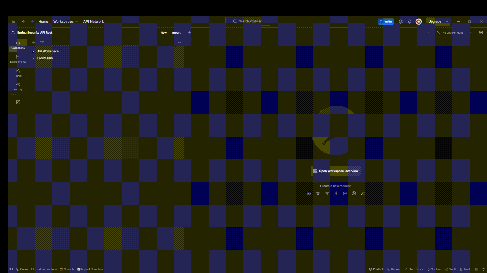

# 📌 API Logs


# 📖 Descrição

Este projeto demonstra a importância da inserção de logs
nas aplicações, seguindo os princípios do SRE 
(Site Reliability Engineering).

A API registra logs estruturados no formato JSON diretamente
no console, permitindo que essas informações sejam facilmente
enviadas para ferramentas como Elasticsearch, Splunk ou Grafana
Loki.

Além disso, os logs também podem ser armazenados em diretórios
locais, possibilitando o compartilhamento das informações entre
equipes quando necessário.


# 🚀 Tecnologias utilizadas

* Java 11
* Spring Boot 2.6.7
* PostgreSQL (latest version)


# 📂 Estrutura do projeto


# ▶️ Como rodar o projeto

## Banco de dados

1. Certifique-se de que o Docker está em execução.
2. No terminal, acesse o diretório onde está localizado o arquivo docker-compose.yml:
```terminal
 cd /caminho/do/seu/projeto
```
3. Execute o seguinte comando para subir os containers:
```terminal
 docker compose up
```
4. Pronto! Agora o ambiente do banco estará configurado e rodando. 🎉



## Aplicação

Execute o projeto com Maven:

mvn spring-boot:run

Os logs estruturados serão exibidos no console 
e armazenados nos diretórios configurados.

- [ ] Inserir instrução
- [ ] Inserir vídeo

## Postman 

- [ ] Inserir instrução
- [ ] Inserir vídeo


# 📬 Contribuição e contato